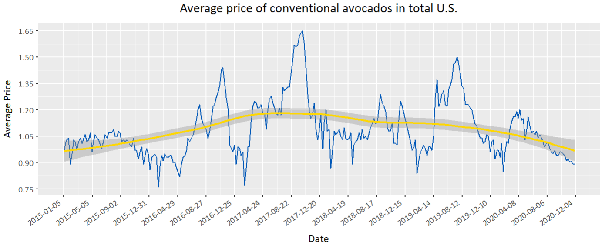
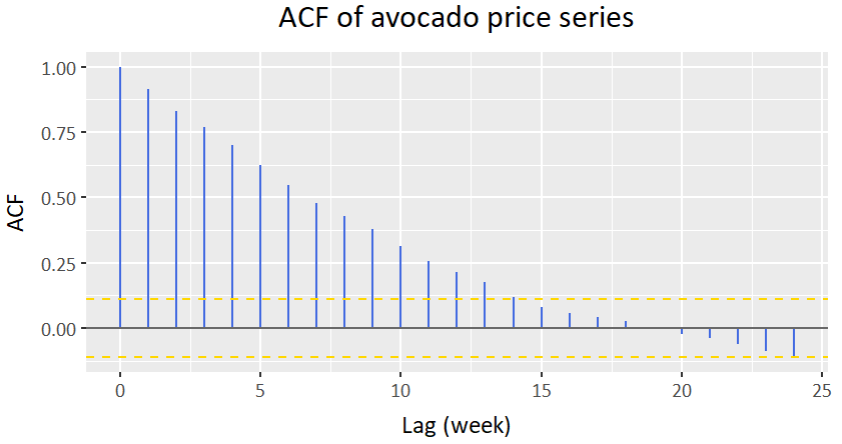
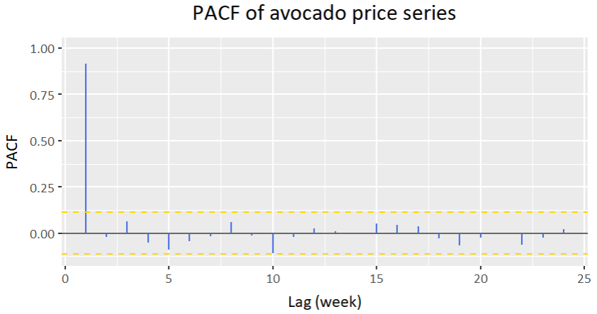

# Time Series Analysis: Avocado Prices
This repository is the final project of the course DATA130013: Time Series Analysis and Spatial Statistic (lectured by Nan Zhang, Fudan University).
I choose the Avocado Prices (2020 updated version) Dataset from Kaggle. The raw dataset is publicly accessible via <https://www.kaggle.com/datasets/timmate/avocado-prices-2020> and uploaded to  ```avocado-updated-2020.csv```. The analytical data I draw from the dataset is a time series of length 306, containing the average price and
volume of conventional avocados in Total U.S.. The preprocessed dataset is uploaded to ```avocado-conventional.CSV```.

The source code for analysis is in ```analysis.R```. To run it successfully you need to install Keras and Tensorflow in R.
```r
install.packages(c('ggplot2', 'ggpubr', 'ggthemes', 'extrafont', 'LSTS'))
install.packages('reticulate')
conda_create('r-reticulate')
use_condaenv('r-reticulate')
install.packages('keras')
library('keras')
install_keras()
install.packages('tensorflow')
library('tensorflow')
install_tensorflow()
```

Or you can install them in your conda environment through anaconda prompt:
```
conda activate r-reticulate
pip install keras
pip install tensorflow
```

Plot of the time series:



ACF and PACF:
<p>
  
</p>
